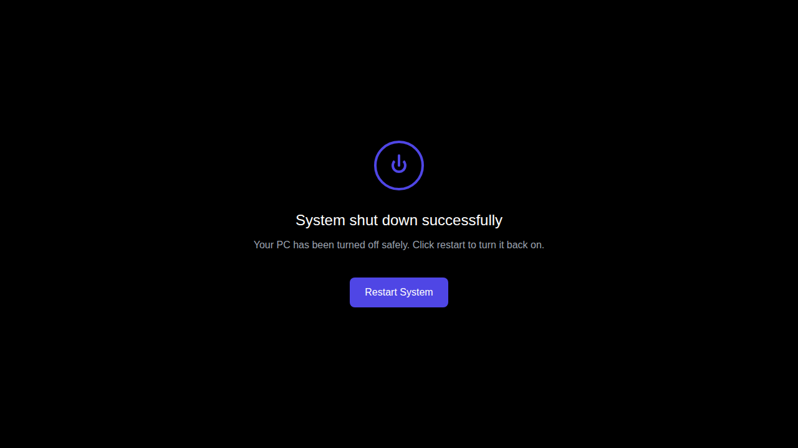

# PC Shutdown Feature

This repository now includes a PC shutdown functionality that allows users to "turn off their PC" within the web application context.

## Feature Overview

A red power button has been added to the top-right corner of the application that simulates shutting down a PC when clicked.

## Screenshots

### 1. Application with Power Button

### 2. Shutdown Process Screen

### 3. Shutdown Complete

### 4. Application After Restart

## How It Works

1. **Power Button**: Click the red circular power button in the top-right corner
2. **Shutdown Animation**: The screen transitions to a black shutdown overlay with a pulsing power icon
3. **Shutdown Message**: Shows "Shutting down..." with animated dots
4. **Completion**: After 3 seconds, displays "System shut down successfully"
5. **Restart**: Click "Restart System" button to return to the main application

## Technical Implementation

- Pure HTML, CSS, and JavaScript implementation
- No external dependencies added
- Minimal changes to existing codebase
- Maintains full compatibility with the original React application
- Smooth animations and transitions
- Responsive design that works on all screen sizes

## Features

- **Visual Feedback**: Power button with hover effects
- **Smooth Animations**: Fade-in effects and pulsing animations
- **Loading Indicators**: Animated dots during shutdown process
- **Full Screen Experience**: Complete overlay for immersive shutdown experience
- **Easy Recovery**: Simple restart button to return to normal operation